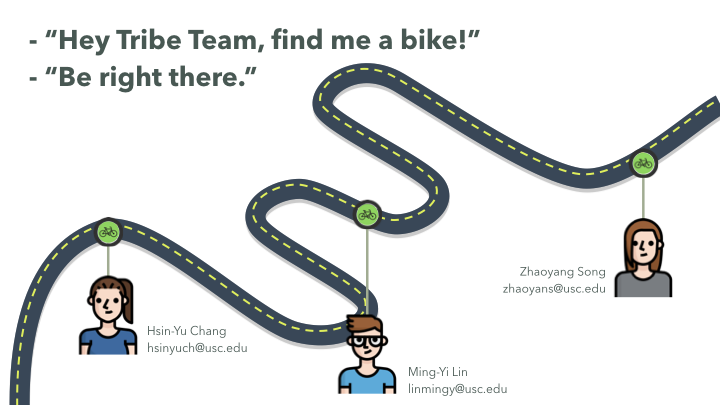
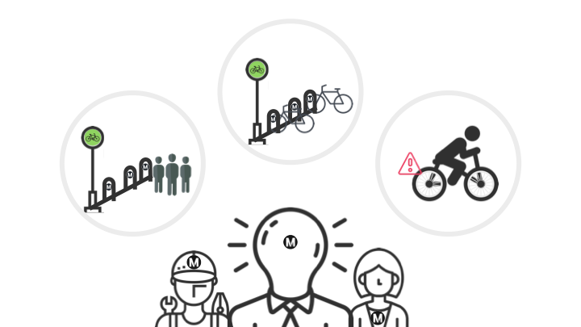
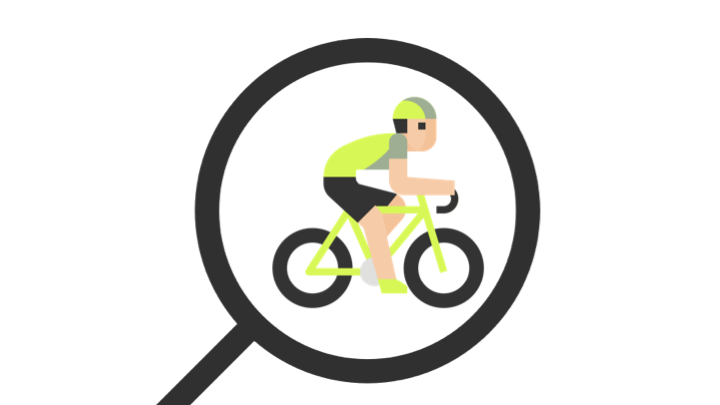
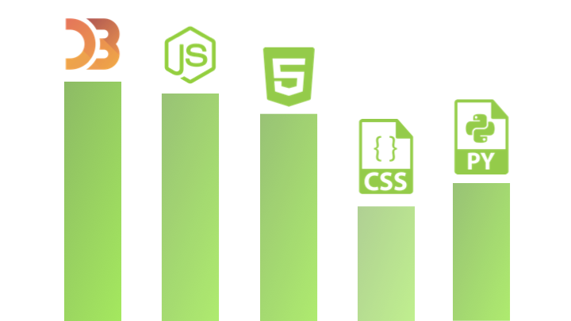
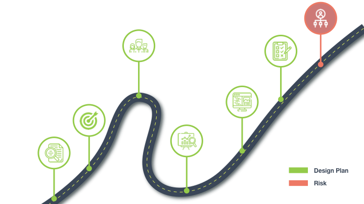
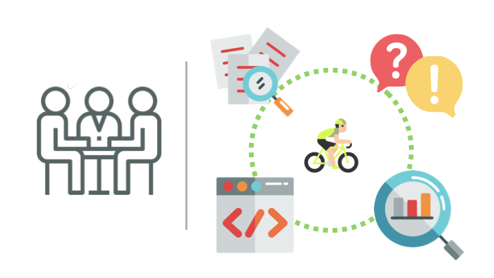
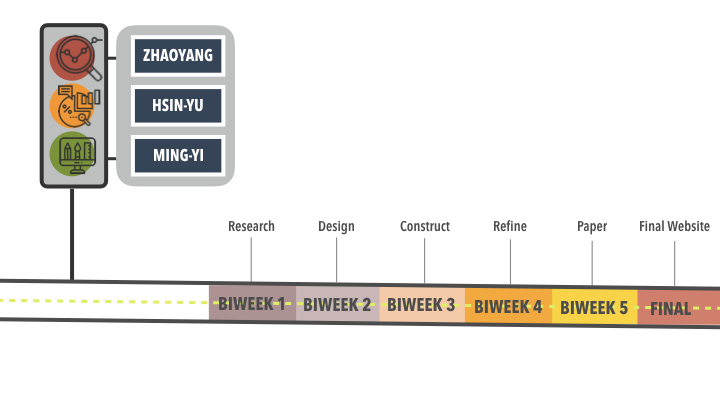

# INF 554 Assignment for 5 - Metro Bike Sharing

### TRIBE - Zhaoyang Song | Hsin-Yu Chang | Ming-Yi Lin

## Overleaf
* [Link](https://www.overleaf.com/8681218574nrbhrmjpqgks)

## Introduction

* Targeted audience : **Metro Bike Institute** 
* Our purposes :
   - **Quality on Maintaining Metro Bikes** 
   
&nbsp;Which stations are high demanding? 
&nbsp;When to refill the bikes to meet the upcoming demand? 
&nbsp;How to tranfer bikes from station to station and maintain the bikes without high depreciation cost?  
&nbsp;How to encourage more users to use metro bikes as their public transportation?

   - **User Behavior Analysis** 

&nbsp;Analyze users when, where and how they rent the metro bikes?

## Our Visualization

* What is the topic?
    - Statistic Visualization of LA Metro Bike Share trip data
* What is the information you plan to present?
    - Maintain the bikes: When Where and how many bikes need to be refilled. Bike depreciation/
    - User behaviours: when do they use the bikes? Where are the start point and end point? What type of    trip? One way or round trip?
    - Performance so far: Are users increasing by years? How many people have the monthly plan or annual plan? How many people are using the free plan?
 
* Do you have a story?
   - "I took Metro every day to go to work at Venice Beach this summer. It still had 20 mins walking distance from the metro station to my company, so I planned to take the metro sharing bike. However, it became so hard for me to find a bike near the metro station. Either there was no bike at all or the bikes there just couldn’t work. However, sometimes I found several stations have way more bikes than it should be." -- Zhaoyang

## Secret Sauce

* Visualizing metro bikers' routes around Los Angeles
* Responsive User Interface: maintainer / marketer /  user mode
* Drill down details when clicking on certain route

## Our Plan

* Dataset : [Metro Bike Share Trip Data](https://bikeshare.metro.net/about/data/]) 
* Data collected from 2017 Q1 to 2019 Q2
* Technology : Javascript, D3.js, HTML5, Python 

* Design plans, building and evaluating : 

 &nbsp; 1. Analyze the bike station data.
 &nbsp; 2. Set the purpose and goals of our website.
 &nbsp; 3. Assign roles to make sure everyone knows their role and tasks.
 &nbsp; 4. Create a content strategy that gives the most efficient way to show information.
 &nbsp; 5. Design and create a mock-up of what our website should look like.
 &nbsp; 6. Develop our website using the technologies mentioned above.
 &nbsp; 7. Evaluate based on features testing, interactivity and visualization wheel.
* Risk : Hard to identify data based on user types since the data doesn't include user id

## How We Work Together?

* Define the purpose and design ideas together in weekly meetings.
* Explore and analyze the data.
* Assign works and set timeline to finish all tasks.
* Meet weekly to 1. solve technical problems. 2. revise design plan

## Our Timeline

* Biweek1 : Reseach on previous works on related topics and collect data which can be linked to our main data.
 e.g. bike lane map, users profiles...
* Biweek2 : Based on research, initial design on prototypes and layouts to meet our purposes.
* Biweek3 : Construct first-sketch website to build up our visualization and functions.
* Biweek4 : Experiment on users and refine the website.
* Biweek5 : Paper elaborating on the whole process we set up our project.
* Final : Final review on website and paper.

## Our Team
Zhaoyang : Product-Oriented thinking, Jquery Interactive Coding, Design skills, Data Analysis
  Hsin-Yu : User Interface Design, Statistical thinking, Data Visualization
  Ming-Yi : Web Developing, User Interface Desing, Data Processing 

## Overleaf Link
[overleaf link](https://www.overleaf.com/8681218574nrbhrmjpqgks)
